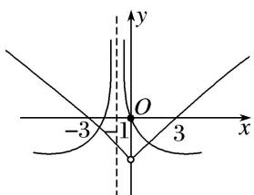

> [!faq]- 教师版对点训练解析
>
> > [!success]- **【答案】** 详见解析
>
> > [!note]- **【分析】**
> > 本题未单列分析。
>
> > [!note]- **【解析】**
> > 答案 3 解析 画出函数 $y = f(x)$ 和 $y = -\lg |x + 1|$ 的大致图象，如图所示．∴由图象知，函数 $g(x) = f(x) + \lg |x + 1|$ 的零点的个数为3.
> > 
