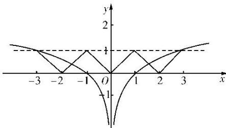

> [!faq]- 教师版对点训练解析
>
> > [!success]- **【答案】** C
>
> > [!note]- **【分析】**
> > 本题未单列分析。
>
> > [!note]- **【解析】**
> > 答案 C 解析 由 $f(x + 2) = f(x)$ ，知函数 $f(x)$ 是周期为 2 的周期函数，且是偶函数，在同一坐标系中画出 $y = \log_3 |x|$ 和 $y = f(x)$ ， $x \in [-3, 3]$ 的图象，如图所示，由图可知零点个数为 4.
> > 
