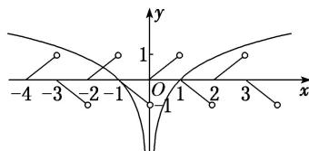

> [!faq]- 教师版对点训练解析
>
> > [!success]- **【答案】** B
>
> > [!note]- **【分析】**
> > 本题未单列分析。
>
> > [!note]- **【解析】**
> > 答案 B 解析 依题意，可知函数 $g(x) = f(x) - \ln |x|$ 的零点个数即为函数 $y = f(x)$ 的图象与函数 $y = \ln |x|$ 的图象的交点个数。设 $-1 \leq x < 0$ ，则 $0 \leq x + 1 < 1$ ，此时有 $f(x) = -f(x + 1) = -(x + 1)$ ，又由 $f(x + 1) = -f(x)$ ，得 $f(x + 2) = -f(x + 1) = f(x)$ ，即函数 $f(x)$ 以 2 为周期的周期函数。而 $y = \ln |x| = \begin{cases} \ln x, & x > 0, \\ \ln (-x), & x < 0, \end{cases}$ 在同一坐标系中作出函数 $y = f(x)$ 的图象与 $y = \ln |x|$ 的图象如图所示，由图可知，两图象有 3 个交点，即函数 $g(x) = f(x) - \ln |x|$ 有 3 个零点，故选 B。
> > 
