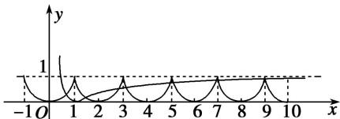

> [!faq]- 教师版对点训练解析
>
> > [!success]- **【答案】** A
>
> > [!note]- **【分析】**
> > 本题未单列分析。
>
> > [!note]- **【解析】**
> > 答案 A 解析 在同一平面直角坐标系中分别作出 $y = f(x)$ 和 $y = |\lg x|$ 的图象，如图．又 $\lg 10 = 1$ ，由图象知选A.
> > 
