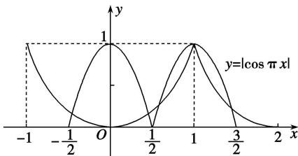

> [!faq]- 教师版对点训练解析
>
> > [!success]- **【答案】** C
>
> > [!note]- **【分析】**
> > 本题未单列分析。
>
> > [!note]- **【解析】**
> > 答案 C 解析 由 $f(-x) = f(x)$ ，得 $f(x)$ 的图象关于 $y$ 轴对称。由 $f(x) = f(2 - x)$ ，得 $f(x)$ 的图象关于直线 $x = 1$ 对称。当 $x \in [0, 1]$ 时， $f(x) = x^3$ ，所以 $f(x)$ 在 $[-1, 2]$ 上的图象如图。令 $g(x) = |\cos \pi x| - f(x) = 0$ ，得 $|\cos \pi x| = f(x)$ ，两函数 $y = f(x)$ 与 $y = |\cos \pi x|$ 的图象在 $[- \frac{1}{2}, \frac{3}{2}]$ 上的交点有 5 个。
> > 
