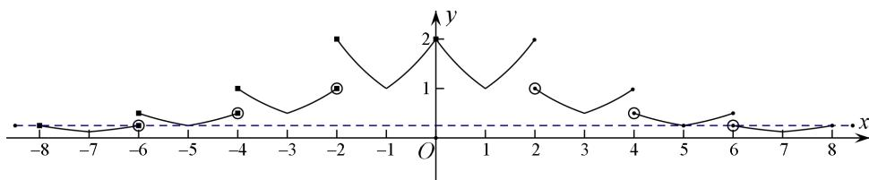

> [!faq]- 教师版对点训练解析
>
> > [!success]- **【答案】** B
>
> > [!note]- **【分析】**
> > 本题未单列分析。
>
> > [!note]- **【解析】**
> > 答案 B 解析 函数 $g(x)=4f(x)-1$ 有零点即 $4f(x)-1=0$ 有解，即 $f(x)=\frac{1}{4}$ ，由题意可知，当 $0<x\leq2$ 时， $f(x)=2^{|x-1|}$ ，当 x>2 时， $f(x)=\frac{1}{2}f(x-2)$ ，所以当 $2<x\leq4$ 时， $f(x)=\frac{1}{2}\times2^{|x-3|}$ ，此时 $f(x)$ 的取值范围为 $\left[\frac{1}{2},1\right]$ ；当 $4<x\leq6$ 时， $f(x)=\frac{1}{4}\times2^{|x-5|}$ ，此时 $f(x)$ 的取值范围为 $\left[\frac{1}{4},\frac{1}{2}\right]$ ，x=5 时， $f(5)=\frac{1}{4}$ ；当 $6<x\leq8$ 时， $f(x)=\frac{1}{8}\times2^{|x-7|}$ ，此时 $f(x)$ 的取值范围为 $\left[\frac{1}{8},\frac{1}{4}\right]$ ，x=8 时， $f(8)=\frac{1}{4}$ ；当 $8<x\leq10$ 时， $f(x)=\frac{1}{16}\times2^{|x-9|}$ ，此时 $f(x)$ 的取值范围为 $\left[\frac{1}{16},\frac{1}{8}\right]$ ，所以当 x>0 时， $f(x)=\frac{1}{4}$ 有两解，即当 x>0 时函数 $g(x)=4f(x)-1$ 有两个零点，因为函数 $f(x)$ 是定义在 $(-∞,0)\cup(0,+∞)$ 上的偶函数，所以当 x<0 时， $f(x)=\frac{1}{4}$ 也有两解，所以函数 $g(x)=4f(x)-1$ 共有四个零点，故选 B.
> > 
