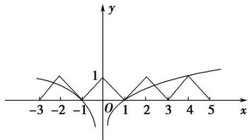

> [!faq]- 《专题15 函数的零点问题(2)-函数》例题解析
>
> > [!success]- **【答案】** A
>
> > [!note]- **【分析】**
> > 本题未单列分析。
>
> > [!note]- **【解析】**
> > 答案 A 解析 由 $f(x + 2) = f(x)$ 知函数 $f(x)$ 是周期为 2 的函数，在同一直角坐标系中，画出 $y_{1} = f(x)$ 与 $y_{2} = \frac{1}{2}\log_{2}|x|$ 的图象，如图所示。由图象可得方程解的个数为 5，故选 A.
> > 
