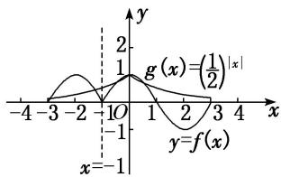

> [!faq]- 《专题15 函数的零点问题(2)-函数》例题解析
>
> > [!success]- **【答案】** A
>
> > [!note]- **【解析】**
> > 答案 A 解析 因为 $f(-1+x)=f(-1-x)$ ，所以函数 $f(x)$ 的图象关于直线 x=-1 对称，又函数 $f(x)$ 的图象关于点 $(1,0)$ 对称，如图所示，画出 $y=f(x)$ 以及 $g(x)=\left(\frac{1}{2}\right)^{|x|}$ 在 $[-3,3]$ 上的图象，由图可知，两函数图象的交点个数为 5，所以函数 $y=f(x)-\left(\frac{1}{2}\right)^{|x|}$ 在区间 $[-3,3]$ 上的零点个数为 5，故选 A.
> >
> > 
