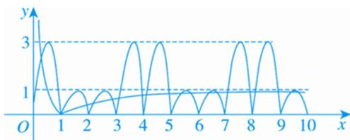

> [!faq]- 《专题15 函数的零点问题(2)-函数》例题解析
>
> > [!success]- **【答案】** C
>
> > [!note]- **【分析】**
> > 本题未单列分析。
>
> > [!note]- **【解析】**
> > 答案 C 解析 $f(x)=\sin\pi x+2|\sin\pi x|=\left\{\begin{aligned}&3\sin\pi x, &0\leq x\leq1,\\&-\sin\pi x, &1<x\leq2,\end{aligned}\right.$ 由 $f(x+4)=f(x)$ 可知， $f(x)$ 是以 4 为周期的
> >
> > 周期函数．方程 $f(x)-|\lg x|=0$ ，即 $f(x)=|\lg x|$ ，方程的根即为函数 $y=f(x)$ 与 $y=|\lg x|$ 图象交点的横坐标，作出两函数图象如图所示.
> >
> > 
> >
> > 由图象可知，方程 $f(x) - |\lg x| = 0$ 在区间[0, 10]上根的个数是19.
