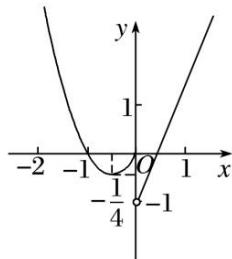

<!-- question-source:start -->
[例1](1)已知函数 $f(x) = \begin{cases} 2x - 1, & x > 0, \\ x^2 + x, & x \leq 0, \end{cases}$ 若函数 $g(x) = f(x) - m$ 有三个零点，则实数 $m$ 的取值范围是 \_\_\_\_. 答案 $\left[-\frac{1}{4}, 0\right]$ 解析作出函数 $f(x)$ 的图象如图所示。当 $x \leq 0$ 时， $f(x) = x^2 + x = \left[x + \frac{1}{2}\right]^2 - \frac{1}{4} \geq -\frac{1}{4}$ ，若函数 $f(x)$ 与 $y = m$ 的图象有三个不同的交点，则 $-\frac{1}{4} < m \leq 0$ ，即实数 $m$ 的取值范围是 $\left[-\frac{1}{4}, 0\right]$ 。

(2)已知函数 $f(x) = \begin{cases} x^2 - 1, & x < 1, \\ \log \frac{1}{2} x, & x \geq 1, \end{cases}$ 若关于 $x$ 的方程 $f(x) = k$ 有三个不同的实根，则实数 $k$ 的取值范围是 \_\_\_\_.

(3)已知 0<a<1, k≠0，函数 $f(x)=\left\{\begin{aligned}a^{x}, & x\geq0, \\ kx+1, & x<0,\end{aligned}\right.$ 若函数 $g(x)=f(x)-k$ 有两个零点，则实数 k 的取值范围是 \_\_\_\_.

(4)对任意实数 a, b 定义运算“⊗”： $a \otimes b = \begin{cases} b, & a - b \geq 1, \\ a, & a - b < 1. \end{cases}$ 设 $f(x) = (x^2 - 1) \otimes (4 + x)$ ，若函数 $g(x) = f(x) + k$ 的图象与 x 轴恰有三个不同的交点，则 k 的取值范围是 \_\_\_\_.

(5)已知 $a > -1$ ，函数 $f(x) = \begin{cases} x^2 & x \leq a \\ \log_2(x + 1) & x > a \end{cases}$ 若存在 $t$ 使得 $g(x) = f(x) - t$ 有三个零点，则 $a$ 的取值范围是（）A. $(-1, 0)$ B. $(0, 1)$ C. $(1, +\infty)$ D. $(0, +\infty)$
<!-- question-source:end -->

![[高中/总复习/专题/函数/专题16 函数的零点问题(3)-函数/专题十六_函数的零点问题_3_/考点一_已知__y___f_x___pm_b__型函数零点的情况求参数__b__的取值范围/例题选讲/例题/answers/Q00030306A1.md]]
