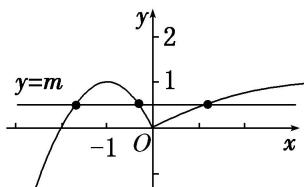

> [!faq]- 教师版对点训练解析
>
> > [!success]- **【答案】** 详见解析
>
> > [!note]- **【分析】**
> > 本题未单列分析。
>
> > [!note]- **【解析】**
> > 答案 (0, 1) 解析 函数 $g(x) = f(x) - m$ 有 3 个零点，转化为 $f(x) - m = 0$ 的根有 3 个，进而转化为 $y = f(x)$ ， $y = m$ 的交点有 3 个。画出函数 $y = f(x)$ 的图象，则直线 $y = m$ 与其有 3 个公共点。又抛物线顶点为 $(-1, 1)$ ，由图可知实数 $m$ 的取值范围是 $(0, 1)$ 。
> > 
