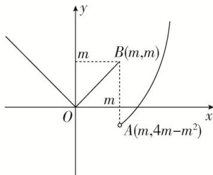

> [!faq]- 教师版对点训练解析
>
> > [!success]- **【答案】** 详见解析
>
> > [!note]- **【分析】**
> > 本题未单列分析。
>
> > [!note]- **【解析】**
> > 答案 $(3, +\infty)$ 解析 $f(x)$ 的大致图象如图所示，
> > 
> > 若存在 $b \in R$ ，使得方程 $f(x) = b$ 有三个不同的根，只需 $4m - m^{2} < m$ ，又 m > 0，所以 m > 3。
