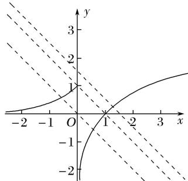
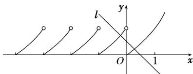
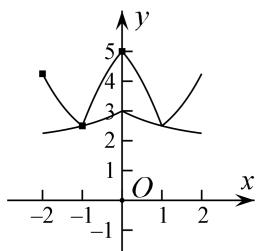
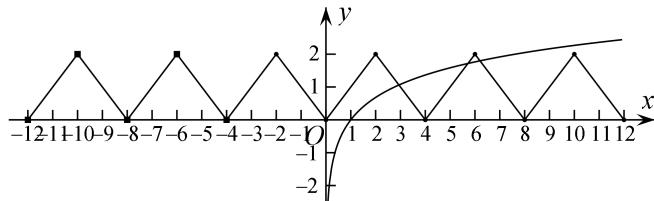
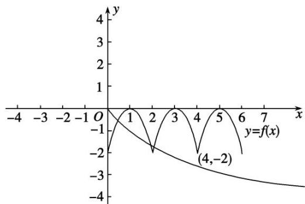
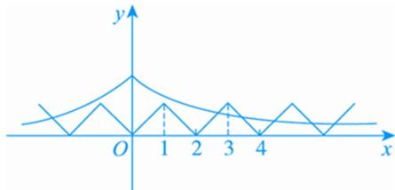

> [!faq]- 教师版例题解析
>
> > [!success]- **【答案】** (1) C；(2) C；(3) 2；(4) $(\sqrt{6},\sqrt{10})$；(5) $(\frac{\sqrt{5}}{5}, 1) \cup (1, +\infty)$；(6) B
>
> > [!note]- **【分析】**
> > 本题未单列分析。
>
> > [!note]- **【解析】**
> > 答案 C 解析 函数 $g(x)=f(x)+x+a$ 存在 2 个零点，即关于 x 的方程 $f(x)=-x-a$ 有 2 个不同的实根，即函数 $f(x)$ 的图象与直线 y=-x-a 有 2 个交点．作出直线 y=-x-a 与函数 $f(x)$ 的图象，如图所示，由图可知， $-a\leq1$ ，解得 $a\geq-1$ ，故选 C.
> > 
> > 答案 C 解析 函数 $f(x)=\left\{\begin{aligned}&2^{x}-1,&x\geq0,\\ &f(x+1),&x<0\end{aligned}\right.$ 的图象如图所示，作出直线 l: y=a-x，向左平移直线 l，观察可得当函数 $y=f(x)$ 的图象与直线 l: $y=-x+a$ 的图象有两个交点，即方程 $f(x)=-x+a$ 有且只有两个不相等的实数根时，有 a<1，故选 C.
> > 
> > 答案 2 解析 由题意可知 $f(x)$ 是周期为 4 的偶函数，画出函数 $f(x)$ 与 $g(x)$ 的大致图象(图略). 若 $F(x)=f(x)-g(x)$ 恰有 2 个零点，则有 $g(1)=f(1)$ ，解得 a=2.
> > 
> > 答案 $(\sqrt{6},\sqrt{10})$ 解析 由 $f(x - 4) = f(x)$ 知，函数的周期为4，又函数为偶函数， $\therefore f(x - 4) = f(x) = f(4 - x)$ . $\therefore$ 函数图象关于 $x = 2$ 对称，且 $f(2) = f(6) = f(10) = 2$ 。要使方程 $f(x) = \log_a x$ 有三个不同的根，则满足 $\left\{ \begin{array}{l}a > 1, \\ f(6) < 2, \\ f(10) > 2, \end{array} \right.$ 如图，即 $\left\{ \begin{array}{l}a > 1, \\ \log_a 6 < 2, \\ \log_a 10 > 2, \end{array} \right.$ 解得 $\sqrt{6} < a < \sqrt{10}$ . 故 $a$ 的取值范围是 $(\sqrt{6},\sqrt{10})$ .
> > 
> > 答案 $(\frac{\sqrt{5}}{5}, 1) \cup (1, +\infty)$ 解析 对于偶函数 $f(x), f(x + 2) = f(x) - f(1)$ ，令 $x = -1$ ，则 $f(1) = f(-1) - f(1)$ ，因为 $f(-1) = f(1)$ ，所以 $f(-1) = f(1) = 0$ ，所以 $f(x) = f(x + 2)$ ，故 $f(x)$ 的图象如图所示，则问题等价于 $f(x)$ 的图象与函数 $y = \log_a(|x| + 1)$ 的图象在 $(0, +\infty)$ 上至多有三个交点，显然 $a > 1$ 符合题意；若 $0 < a < 1$ ，则由图可知，只需点 $(4, -2)$ 在函数 $y = \log_a(|x| + 1)$ 图象的上方，所以 $\log_a 5 < -2 = \log_a \frac{1}{a^2} \Rightarrow 5 > \frac{1}{a^2} \Rightarrow \frac{\sqrt{5}}{5} < a < 1$ 。综上，实数 $a$ 的取值范围是 $(\frac{\sqrt{5}}{5}, 1) \cup (1, +\infty)$ 。
> > 
> > 答案 B 解析 $f(x)$ 满足条件 $f(1+x)=f(1-x)$ 且为奇函数，则 $f(x)$ 的图象关于 x=1 对称，且 $f(x)=f(2-x)$ ， $f(x)=-f(-x)$ ， $\therefore-f(-x)=f(2-x)$ ，即 $-f(x)=f(2+x)$ ， $\therefore f(x+4)=f(x)$ ， $\therefore f(x)$ 的周期为 4．令 $m(x)=|f(x)|$ ， $n(x)=ae^{-|x|}$ ，画出 $m(x)$ 、 $n(x)$ 的图象如图，
> > 
> > 可知 $m(x)$ 与 $n(x)$ 为偶函数, 且要使 $m(x)$ 与 $n(x)$ 图象有交点, 需 a > 0, 由题意知要满足 $g(x)$ 在区间 $[-2\ 018, 2\ 018]$ 上有 4032 个零点, 只需 $m(x)$ 与 $n(x)$ 的图象在 $[0, 4]$ 上有两个交点, 则 $\left\{\begin{aligned}m(1) &<n(1), \\ m(3) &>n(3),\end{aligned}\right.$ 可得 $e < a < e^{3}$ ,
> >
> > 故选 **B**.
