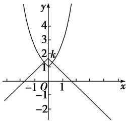

> [!faq]- 教师版对点训练解析
>
> > [!success]- **【答案】** B
>
> > [!note]- **【分析】**
> > 本题未单列分析。
>
> > [!note]- **【解析】**
> > 答案 B 解析 方程 $f(x) = k$ 化为方程 $e^{|x|} = k - |x|$ . 令 $y = e^{|x|}$ , $y = k - |x|$ , $y = k - |x|$ 表示过点 (0, k)，斜率为 1 或 -1 的平行折线系，折线与曲线 $y = e^{|x|}$ 恰好有一个公共点时，有 $k = 1$ . 若关于 $x$ 的方程 $f(x) = k$ 有两个不同的实根，则实数 $k$ 的取值范围是 (1, +∞).
> > 
