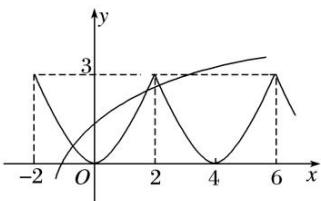

> [!faq]- 教师版对点训练解析
>
> > [!success]- **【答案】** 详见解析
>
> > [!note]- **【分析】**
> > 本题未单列分析。
>
> > [!note]- **【解析】**
> > 答案 $\sqrt[3]{4} < a < 2$ 解 根据题意得 $f((x + 2) - 2) = f((x + 2) + 2)$ ，即 $f(x) = f(x + 4)$ ，故函数 $f(x)$ 的周期为 4。若方程 $f(x) - \log_a(x + 2) = 0 (a > 1)$ 在区间 $[-2, 6]$ 内恰有三个不同的实根，则函数 $y = f(x)$ 和 $y = \log_a(x + 2)$ 的图象在区间 $[-2, 6]$ 内恰有三个不同的交点，根据图象可知， $\log_a(6 + 2) > 3$ 且 $\log_a(2 + 2) < 3$ ，解得 $\sqrt[3]{4} < a < 2$ 。
> > 
