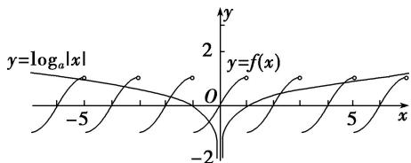
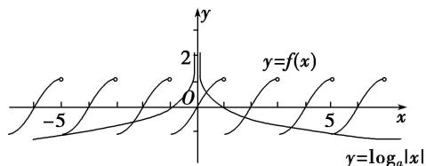

> [!faq]- 教师版对点训练解析
>
> > [!success]- **【答案】** A
>
> > [!note]- **【分析】**
> > 本题未单列分析。
>
> > [!note]- **【解析】**
> > 答案 A 解析 当 a > 1 时，作出函数 $f(x)$ 与函数 $y = \log_{a} |x|$ 的图象，如图所示．结合图象可知， $\left\{\begin{aligned}\log_{a}|-5|<1,\\ \log_{a}|5|<1,\end{aligned}\right.$ 故 a>5;
> > 
> > 当 0 < a < 1 时，作出函数 $f(x)$ 与函数 $y = \log_{a}|x|$ 的图象，如图所示．结合图象可知， $\left\{\begin{aligned}\log_{a}|-5|\geq-1,\\ \log_{a}|5|\geq-1,\end{aligned}\right.$ 故 $0 < a \leq \frac{1}{5}$ . 故选 A.
> > 
