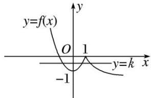

> [!faq]- 《专题16 函数的零点问题(3)-函数》例题解析
>
> > [!success]- **【答案】** 详见解析
>
> > [!note]- **【解析】**
> > 答案 $(-1, 0)$ 解析 关于 $x$ 的方程 $f(x) = k$ 有三个不同的实根，等价于函数 $y = f(x)$ 与函数 $y = k$ 的图象有三个不同的交点，作出函数的图象如图所示，由图可知实数 $k$ 的取值范围是 $(-1, 0)$ .
> >
> > 
