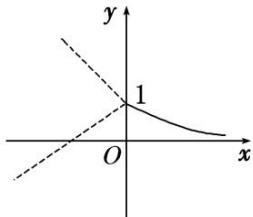

> [!faq]- 《专题16 函数的零点问题(3)-函数》例题解析
>
> > [!success]- **【答案】** 详见解析
>
> > [!note]- **【分析】**
> > 本题未单列分析。
>
> > [!note]- **【解析】**
> > 答案 (0, 1) 解析 函数 $g(x) = f(x) - k$ 有两个零点，即 $f(x) - k = 0$ 有两个解，即 $y = f(x)$ 与 $y = k$ 的图象有两个交点。分 $k > 0$ 和 $k < 0$ 作出函数 $f(x)$ 的图象。当 $0 < k < 1$ 时，函数 $y = f(x)$ 与 $y = k$ 的图象有两个交点；当 $k = 1$ 时，有一个交点；当 $k > 1$ 或 $k < 0$ 时，没有交点，故当 $0 < k < 1$ 时满足题意。
> > 
