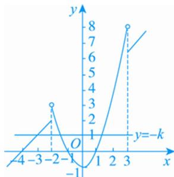

> [!faq]- 《专题16 函数的零点问题(3)-函数》例题解析
>
> > [!success]- **【答案】** 详见解析
>
> > [!note]- **【分析】**
> > 本题未单列分析。
>
> > [!note]- **【解析】**
> > 答案 $[-2, 1)$ 解析 解不等式 $x^{2} - 1 - (4 + x) \geq 1$ ，得 $x \leq -2$ 或 $x \geq 3$ ，所以 $f(x) = \begin{cases} x + 4, & x \in (-\infty, -2] \cup [3, +\infty), \\ x^{2} - 1, & x \in (-2, 3). \end{cases}$ 函数 $g(x) = f(x) + k$ 的图象与 $x$ 轴恰有三个不同的交点转化为
> > 
> > 函数 $f(x)$ 的图象和直线 $y = -k$ 恰有三个不同的交点．作出函数 $f(x)$ 的图象如图所示，所以 $-1 < -k \leq 2$ ，故 $-2 \leq k < 1$ ．
