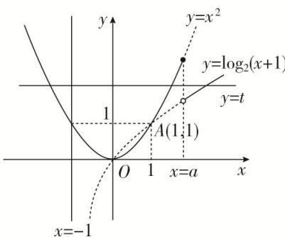

> [!faq]- 《专题16 函数的零点问题(3)-函数》例题解析
>
> > [!success]- **【答案】** C
>
> > [!note]- **【分析】**
> > 本题未单列分析。
>
> > [!note]- **【解析】**
> > 答案 C 解析 如图，作出函数 $y=x^{2}$ 和 $y=\log_{2}(x+1)$ 的图象，从图中可以看出，在点 $O(0,0)$ 和点 $A(1,1)$ 处两函数图象有交点，显然，要使 $g(x)=f(x)-t$ 有三个零点，则函数 $y=f(x)$ 的图象与直线 y=t 有三个交点，显然，只有当 a>1 时，才可能有三个交点，故选 C.
> > 
> > 【对点训练】
