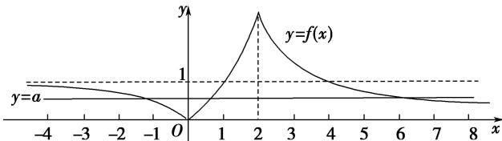

> [!faq]- 《专题16 函数的零点问题(3)-函数》例题解析
>
> > [!success]- **【答案】** D
>
> > [!note]- **【分析】**
> > 本题未单列分析。
>
> > [!note]- **【解析】**
> > 答案 D 解析 画出函数 $f(x)$ 的图象如图所示,
> >
> > 
> >
> > 观察图象可知，若方程 $f(x) - a = 0$ 有三个不同的实数根，则函数 $y = f(x)$ 的图象与直线 $y = a$ 有3个不同的交点，此时需满足 $0 < a < 1$ 。
> >
> > 故选 **D**.
