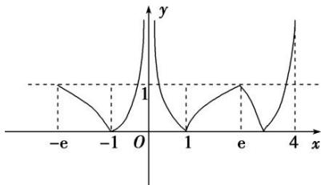
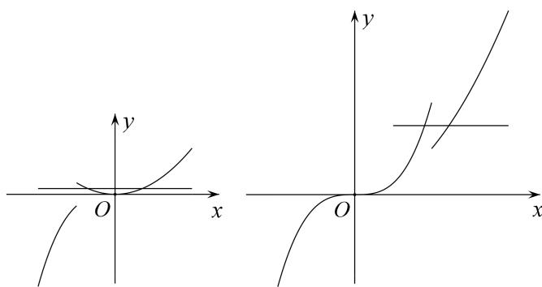

> [!faq]- 《专题16 函数的零点问题(3)-函数》例题解析
>
> > [!success]- **【答案】** 详见解析
>
> > [!note]- **【分析】**
> > 本题未单列分析。
>
> > [!note]- **【解析】**
> > 答案 (0, 1) 解析 由题意画出函数 $f(x)$ 在 $[-e, 4]$ 上的图象，如图所示.
> >
> > 
> >
> > 又 $f(x)=a$ 在 $[-e, 4]$ 上有 6 个零点，数形结合可知，实数 a 的取值范围为 $(0, 1)$ .
> >
> > 
