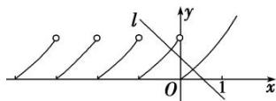

> [!faq]- 《专题16 函数的零点问题(3)-函数》例题解析
>
> > [!success]- **【答案】** 详见解析
>
> > [!note]- **【解析】**
> > 答案 $(-∞, 1)$ 解析 函数 $f(x)=\left\{\begin{aligned}&2^{x}-1 & (x\geq0),\\&f(x+1) & (x<0)\end{aligned}\right.$ 的图象如图所示，作出直线 l: y=a-x，向左平移直线 l，观察可得函数 $y=f(x)$ 的图象与直线 l: $y=-x+a$ 的图象有两个交点，即方程 $f(x)=-x+a$ 有且只有两个不相等的实数根，即有 a<1.
> >
> > 
