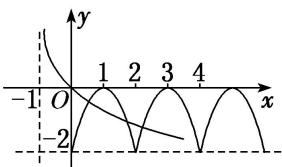

> [!faq]- 《专题16 函数的零点问题(3)-函数》例题解析
>
> > [!success]- **【答案】** A
>
> > [!note]- **【分析】**
> > 本题未单列分析。
>
> > [!note]- **【解析】**
> > 答案 A 解析 $\because f(x+2)=f(x)-f(1), f(x)$ 是偶函数, $\therefore f(1)=0$ , $\therefore f(x+2)=f(x)$ , 即 $f(x)$ 是周期为 2 的周期函数, 且 $y=f(x)$ 的图象关于直线 $x=2$ 对称, 作出函数 $y=f(x)$ 与 $g(x)=\log_a(x+1)$ 的图象如图所示, $\because$ 两个函数图象在 $(0, +\infty)$ 上至少有三个交点, $\therefore g(2)=\log_a3>f(2)=-2$ , 且 $0<a<1$ , 解得 $0<a<\frac{\sqrt{3}}{3}$ , 故选 A.
> > 
