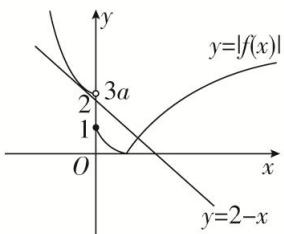

> [!faq]- 《专题16 函数的零点问题(3)-函数》例题解析
>
> > [!success]- **【答案】** A
>
> > [!note]- **【分析】**
> > 本题未单列分析。
>
> > [!note]- **【解析】**
> > 答案 C 解析 由 $y = \log_a(x + 1) + 1$ 在 $[0, +\infty)$ 上递减，则 $0 < a < 1$ ，又由 $f(x)$ 在 R 上单调递减，则： $\left\{ \begin{array}{l} 0^2 + (4a - 3) \cdot 0 + 3a \geq f(0) = 1, \\ \frac{3 - 4a}{2} \geq 0, \end{array} \right.$ 解得 $\frac{1}{3} \leq a \leq \frac{3}{4}$ .
> >
> > 
> >
> > 结合 $f(x)$ 的图象可知，在 $[0, +\infty)$ 上， $|f(x)| = 2 - x$ 有且仅有一个解，故在 $(- \infty, 0)$ 上， $|f(x)| = 2 - x$ 同样有且仅有一个解，当 $3a > 2$ ，即 $a > \frac{2}{3}$ 时，联立 $|x^2 + (4a - 3)x + 3a| = 2 - x$ ，则 $\Delta = (4a - 2)^2 - 4(3a - 2)$
> >
> > =0，解得： $a=\frac{3}{4}$ 或1(舍)，当 $1\leq3a\leq2$ 时，由图象可知，符合条件．综上： $a\in\left[\frac{1}{3},\frac{2}{3}\right]\cup\left\{\frac{3}{4}\right\}$ .
