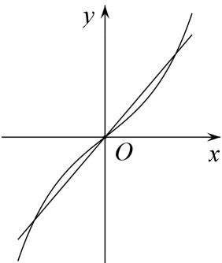
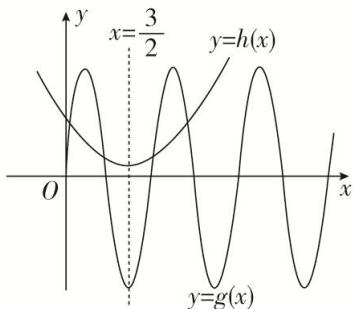
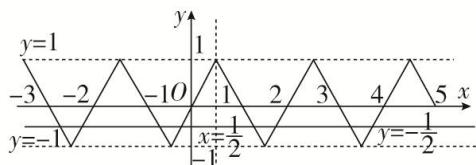
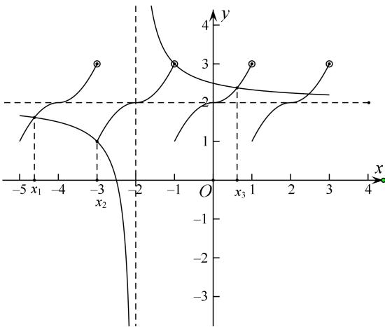
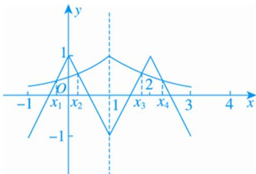

> [!faq]- 教师版例题解析
>
> > [!success]- **【答案】** (1) 0；(2) A；(3) 4；(4) C；(5) B
>
> > [!note]- **【分析】**
> > 本题未单列分析。
>
> > [!note]- **【解析】**
> > 答案 0 解析 方程 $f(x) = kx + 4 (k > 0)$ 有三个不同的实根，即方程 $e^x - e^{-x} = kx$ 有三个不同的实根，易知 $y = e^x - e^{-x}$ 为奇函数且递增，得 $y = f(x)$ 的图象．所以 $y = f(x)$ 的图象关于点(0, 0)对称，又 $y = kx$ 过点(0, 0)且关于(0, 0)对称．∴方程 $e^x - e^{-x} = kx$ 的三个根中有一个为0，且另两根之和为0．因此 $x_1 + x_2 + x_3 = 0$ .
> > 
> > 答案 A 解析 $h(x)=x^{2}-3x+\frac{13}{4}=(x-\frac{3}{2})^{2}+1$ 的图象关于 $x=\frac{3}{2}$ 对称，设函数 $g(x)=8\cos\pi(\frac{1}{2}-x)$ . 由 $\pi(\frac{1}{2}-x)=k\pi$ ，可得 $x=\frac{1}{2}-k(k\in\mathbf{Z})$ ，令 k=-1 可得 $x=\frac{3}{2}$ ，所以函数 $g(x)=8\cos\pi(\frac{1}{2}-x)$ 的图象也关于 $x=\frac{3}{2}$ 对称．当 $x=\frac{1}{2}$ 时， $h(\frac{1}{2})=2<g(\frac{1}{2})=8$ ，作出函数 $h(x)$ ， $g(x)$ 的图象．由图可知函数 $h(x)=x^{2}-3x+\frac{13}{4}=(x-\frac{3}{2})^{2}+1$ 的图象与函数 $g(x)=8\cos(\pi\frac{1}{2}-x)$ 的图象有四个交点，所以函数 $f(x)=x^{2}-3x+\frac{13}{4}-8\cos(\pi\frac{1}{2}-x)$ 在 $(0,+\infty)$ 上的零点个数为 4，所有零点之和为 $4\times\frac{3}{2}=6$ ，故选 A.
> > 
> > 答案 4 解析 ∵函数 $f(x+1)$ 是奇函数，∴函数 $f(x+1)$ 的图象关于点 $(0,0)$ 对称，把函数 $f(x+1)$ 的图象向右平移 1 个单位可得函数 $f(x)$ 的图象，即函数 $f(x)$ 的图象关于点 $(1,0)$ 对称，则 $f(2-x)=-f(x)$ . 又 ∵ $f(\frac{1}{2}+x)=f(\frac{1}{2}-x)$ , ∴ $f(1-x)=f(x)$ ，从而 $f(2-x)=-f(1-x)$ , ∴ $f(x+1)=-f(x)$ ，即 $f(x+2)=-f(x+1)=f(x)$ , ∴ 函数 $f(x)$ 的周期为 2，且图象关于直线 $x=\frac{1}{2}$ 对称．画出函数 $f(x)$ 的图象如图所示.
> > 
> > ∴结合图象可得方程 $f(x)=-\frac{1}{2}$ 在区间 $[-3,5]$ 内有 8 个根，且所有根之和为 $\frac{1}{2}\times2\times4=4$ .
> > 答案 C 解析 先做图观察实根的特点，在 $[-1, 1)$ 中，通过作图可发现 $f(x)$ 在 $(-1, 1)$ 关于 $(0, 2)$ 中心对称，由 $f(x+2)=f(x)$ 可得 $f(x)$ 是周期为2的周期函数，则在下一个周期 $(-3, -1)$ 中， $f(x)$ 关于 $(-2, 2)$ 中心对称，以此类推。从而做出 $f(x)$ 的图像（此处要注意区间端点值在何处取到），再看 $g(x)$ 图像， $g(x)=\frac{2x+5}{x+2}=2+\frac{1}{x+2}$ ，可视为将 $y=\frac{1}{x}$ 的图像向左平移2个单位后再向上平移2个单位，所以对称中心移至 $(-2, 2)$ ，刚好与 $f(x)$ 对称中心重合，如图所示：可得共有3个交点 $x_1<x_2<x_3$ ，其中 $x_2=-3$ ， $x_1$ 与 $x_3$ 关于 $(-2, 2)$ 中心对称，所以有 $x_1+x_3=-4$ 。所以 $x_1+x_2+x_3=-7$ 。
> > 
> > 答案 B 解析 $\because f(x + 1) = -f(x), \therefore f(x + 2) = -f(x + 1) = f(x), \therefore f(x)$ 的周期为 2．又 $f(x)$ 为偶函数， $\therefore f(1 - x) = f(x - 1) = f(x + 1)$ ，故 $f(x)$ 的图象关于直线 $x = 1$ 对称．又 $g(x) = \left(\frac{1}{2}\right)^{|x - 1|} (-1 \leq x \leq 3)$ 的图象关于直线 $x = 1$ 对称，作出 $f(x)$ 和 $g(x)$ 的图象如图所示.
> > 
> > 由图象可知两函数图象在[-1, 3]上共有4个交点，分别记从左到右各交点的横坐标为 $x_{1}$ ， $x_{2}$ ， $x_{3}$ ， $x_{4}$ ，可知 $x=x_{1}$ 与 $x=x_{4}$ ， $x=x_{2}$ 与 $x=x_{3}$ 分别关于x=1对称，∴所有交点的横坐标之和为 $x_{1}+x_{2}+x_{3}+x_{4}=1\times2\times2=4$ ，
> >
> > 故选 **B**.
