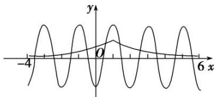

> [!faq]- 教师版对点训练解析
>
> > [!success]- **【答案】** 详见解析
>
> > [!note]- **【分析】**
> > 本题未单列分析。
>
> > [!note]- **【解析】**
> > 答案 10 解析 可转化为两个函数 $y = \left(\frac{1}{2}\right)^{|x - 1|}$ 与 $y = -2\cos \pi x$ 在 $[-4, 6]$ 上的交点的横坐标的和，因为两个函数均关于 $x = 1$ 对称，所以两个函数在 $x = 1$ 两侧的交点对称，则每对对称点的横坐标的和为 2，分别画出两个函数的图象易知两个函数在 $x = 1$ 两侧分别有 5 个交点，所以 $5 \times 2 = 10$ .
> > 
