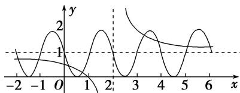

> [!faq]- 教师版对点训练解析
>
> > [!success]- **【答案】** D
>
> > [!note]- **【分析】**
> > 本题未单列分析。
>
> > [!note]- **【解析】**
> > 答案 D 解析 令 $F(x) = f(x) - g(x) = 0$ ，得 $f(x) = g(x)$ ，在同一平面直角坐标系中分别画出函数 $f(x) = 1 + \frac{1}{x - 2}$ 与 $g(x) = 1 - \sin \pi x$ 的图象，如图所示，又 $f(x), g(x)$ 的图象都关于点(2, 1)对称，结合图象可知 $f(x)$ 与 $g(x)$ 的图象在[-2, 6]上共有8个交点，交点的横坐标即 $F(x) = f(x) - g(x)$ 的零点，且这些交点关于直线 $x = 2$ 成对出现，由对称性可得所有零点之和为 $4 \times 2 \times 2 = 16$ ，故选D.
> > 
