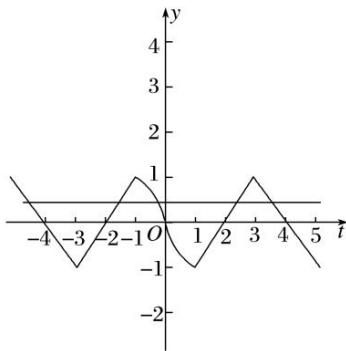

> [!faq]- 教师版对点训练解析
>
> > [!success]- **【答案】** 详见解析
>
> > [!note]- **【分析】**
> > 本题未单列分析。
>
> > [!note]- **【解析】**
> > 答案 $\frac{1}{1 - 2\pi}$ 解析 由题意知，当 $x < 0$ 时， $f(x) = \begin{cases} -\frac{2x}{1 - x}, & x \in [-1, 0], \\ |x + 3| - 1, & x \in -\infty, -1], \end{cases}$ 作出函数 $f(x)$ 的图象如图所示，设函数 $y = f(x)$ 的图象与 $y = \frac{1}{\pi}$ 交点的横坐标从左到右依次为 $x_1, x_2, x_3, x_4, x_5$ ，由图象的对称性可知， $x_1 + x_2 = -6, x_4 + x_5 = 6, x_1 + x_2 + x_4 + x_5 = 0$ ，令 $-\frac{2x}{1 - x} = \frac{1}{\pi}$ ，解得 $x_3 = \frac{1}{1 - 2\pi}$ ，所以函数 $F(x) = f(x) - \frac{1}{\pi}$ 的所有零点之和为 $\frac{1}{1 - 2\pi}$ .
> > 
