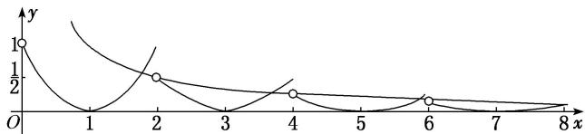

> [!faq]- 教师版对点训练解析
>
> > [!success]- **【答案】** A
>
> > [!note]- **【分析】**
> > 本题未单列分析。
>
> > [!note]- **【解析】**
> > 答案 A 解析 令 $g(x) = xf(x) - 1 = 0$ ，则 $x \neq 0$ ，所以函数 $g(x)$ 的零点之和等价于函数 $y = f(x)$ 的图象和 $y = \frac{1}{x}$ 的图象的交点的横坐标之和，分别作出 $x > 0$ 时， $y = f(x)$ 和 $y = \frac{1}{x}$ 的大致图象，如图所示，
> > 
> > 由于 $y=f(x)$ 和 $y=\frac{1}{x}$ 的图象都关于原点对称，因此函数 $g(x)$ 在 $[-6,6]$ 上的所有零点之和为 0，而当 x=8 时， $f(x)=\frac{1}{8}$ ，即两函数的图象刚好有 1 个交点，且当 $x\in(8,+\infty)$ 时， $y=\frac{1}{x}$ 的图象都在 $y=f(x)$ 的图象的上方，因此 $g(x)$ 在 $[-6,+\infty)$ 上的所有零点之和为 8.
