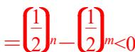
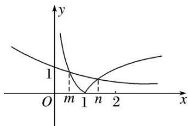

> [!faq]- 教师版对点训练解析
>
> > [!success]- **【答案】** C
>
> > [!note]- **【分析】**
> > 本题未单列分析。
>
> > [!note]- **【解析】**
> > 答案 C 解析 由题设可得 $|\log_a x| = \left(\frac{1}{2}\right)^m$ ，不妨设 $a > 1$ ， $m < n$ ，画出函数 $y = |\log_a x|$ ， $y = \left(\frac{1}{2}\right)^m$ 的图象如图所示，结合图象可知 $0 < m < 1$ ， $n > 1$ ，且 $-\log_a m = \left(\frac{1}{2}\right)^m$ ， $\log_a n = \left(\frac{1}{2}\right)^n$ ，以上两式两边相减可得 $\log_a(mn) = \left(\frac{1}{2}\right)^n - \left(\frac{1}{2}\right)^m < 0$ ，所以 $0 < mn < 1$ ，故选 C.
> > 
> > 
