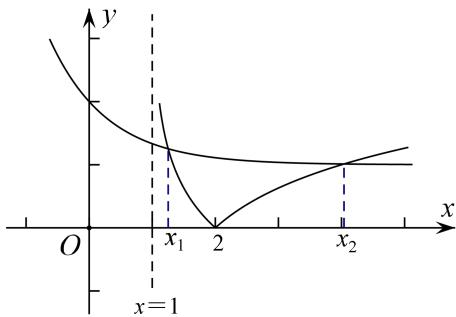

> [!faq]- 教师版对点训练解析
>
> > [!success]- **【答案】** D
>
> > [!note]- **【分析】**
> > 本题未单列分析。
>
> > [!note]- **【解析】**
> > 答案 D 解析 可将零点化为方程 $|\log_3(x - 1)| = (\frac{1}{3})^x + 1$ 的根，进而转化为 $g(x) = |\log_3(x - 1)|$ 与 $h(x) = (\frac{1}{3})^x + 1$ 的交点，作出图像可得 $1 < x_1 < 2 < x_2$ ，进而可将 $|\log_3(x - 1)| = (\frac{1}{3})^x + 1$ 中的绝对值去掉得， $-\log_3(x_1)$
> > $-1) = (\frac{1}{3})^{x_1} + 1$ ， $-\log_3(x_2 - 1) = (\frac{1}{3})^{x_2} + 1$ ，观察选项涉及 $x_1x_2$ ， $x_1 + x_2$ ，故将②-①可得 $\log_3[(x_1 - 1)(x_2 - 1)] = (\frac{1}{3})^{x_1} - (\frac{1}{3})^{x_2}$ ，而 $y = (\frac{1}{3})^x$ 为减函数，且 $x_2 > x_1$ ，从而 $\log_3[(x_1 - 1)(x_2 - 1)] < 0$ ， $(x_1 - 1)(x_2 - 1) < 1$ ， $x_1x_2 < x_1 + x_2$ .
> > 
