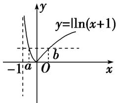

> [!faq]- 教师版对点训练解析
>
> > [!success]- **【答案】** A
>
> > [!note]- **【分析】**
> > 本题未单列分析。
>
> > [!note]- **【解析】**
> > 答案 A 解析 作出函数 $f(x) = |\ln (x + 1)|$ 的图象如图所示，由 $f(a) = f(b)(a < b)$ ，得 $-\ln (a + 1) = \ln (b + 1)$ ，即 $ab + a + b = 0$ ，所以 $0 = ab + a + b < \frac{(a + b)^2}{4} + a + b$ ，即 $(a + b)(a + b + 4) > 0$ ，又易知 $-1 < a < 0$ ， $b > 0$ . 所以 $a + b + 4 > 0$ ，所以 $a + b > 0$ . 故选 A.
> > 
