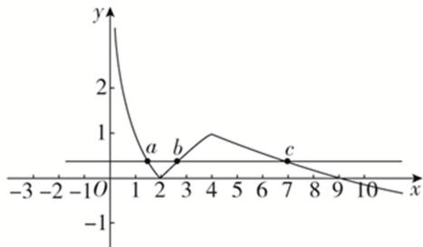

> [!faq]- 教师版对点训练解析
>
> > [!success]- **【答案】** 详见解析
>
> > [!note]- **【分析】**
> > 本题未单列分析。
>
> > [!note]- **【解析】**
> > 答案 (16, 36) 解析 作出 $f(x)$ 的图象如图，
> > 
> > 当 x>4 时，由 $f(x)=3-\sqrt{x}=0$ ，得 $\sqrt{x}=3$ ，得 x=9，若 a, b, c 互不相等，不妨设 a<b<c，因为 $f(a)=f(b)=f(c)$ ，所以由图象可知 0<a<2<b<4<c<9，由 $f(a)=f(b)$ ，得 $1-\log_{2}a=\log_{2}b-1$ ，即 $\log_{2}a+\log_{2}b=2$ ，即 $\log_{2}(ab)=2$ ，则 ab=4，所以 abc=4c，因为 4<c<9，所以 16<4c<36，即 16<abc<36，所以 abc 的取值范围是 (16, 36).
