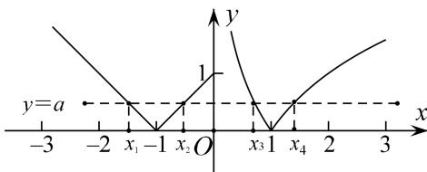

> [!faq]- 教师版对点训练解析
>
> > [!success]- **【答案】** B
>
> > [!note]- **【分析】**
> > 本题未单列分析。
>
> > [!note]- **【解析】**
> > 答案 B 解析 作出 $f(x)$ 的图像可知若 $f(x) = a$ 有四个不同的解，则 $a \in (0,1]$ ，且在这四个根中， $x_1, x_2$ ，关于直线 $x = -1$ 对称，所以 $x_1 + x_2 = -2$ ， $x_3 < 1 < x_4$ ，所以 $a = -\log_2 x_3 = \log_2 x_4$ ，即 $x_3 = (\frac{1}{2})^a$ ， $x_4 = 2^a$ ，所以 $g(a) = x_1 + x_2 + \frac{1}{x_3} + \frac{1}{x_4} = -2 + 2^a + (\frac{1}{2})^a$ ，由 $a \in (0,1]$ ，可得 $g(a)$ 的范围是 $(0, \frac{1}{2}]$ .
> > 
