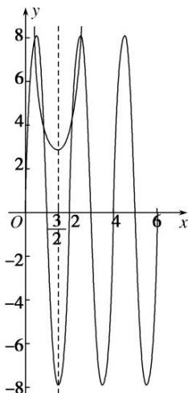

<!-- question-source:start -->
2. 已知 $M$ 是函数 $f(x) = \mathrm{e}x^2 - 3x + \frac{13}{4} - 8\cos \left[\pi \left(\frac{1}{2} - x\right)\right]$ 在 $x \in (0, +\infty)$ 上的所有零点之和，则 $M$ 的值为（）A. 3 B. 6 C. 9 D. 12

<!-- question-source:end -->

![[高中/总复习/专题/函数/专题17 函数的零点问题(4)-函数/考点01_与零点相关的等式问题/对点训练/answers/Q00041245A1.md]]
