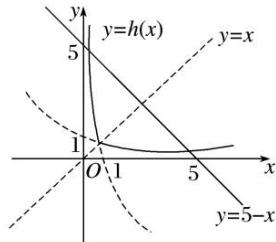

> [!faq]- 《专题17 函数的零点问题(4)-函数》例题解析
>
> > [!success]- **【答案】** 详见解析
>
> > [!note]- **【分析】**
> > 本题未单列分析。
>
> > [!note]- **【解析】**
> > 答案 5 解析 由题意知函数 $h(x)$ 的图象如图所示, 易知函数 $h(x)$ 的图象关于直线 $y = x$ 对称, 函数 $F(x)$ 所有零点的和就是函数 $y = h(x)$ 与函数 $y = 5 - x$ 图象交点横坐标的和, 设图象交点的横坐标分别为 $x_{1}, x_{2}$ , 因为两函数图象的交点关于直线 $y = x$ 对称, 所以 $\frac{x_1 + x_2}{2} = 5 - \frac{x_1 + x_2}{2}$ , 所以 $x_1 + x_2 = 5$ .
> > 
