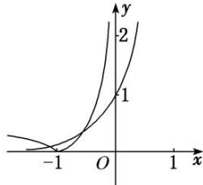

> [!faq]- 《专题17 函数的零点问题(4)-函数》例题解析
>
> > [!success]- **【答案】** A
>
> > [!note]- **【解析】**
> > 答案 D 解析 作出函数 $y = 10^{x}$ ， $y = |\lg (-x)|$ 的图象，由图象可知，两个根一个小于-1，一个在(-1, 0)之间，不妨设 $x_{1} < -1$ ， $-1 < x_{2} < 0$ ，则 $10x_{1} = \lg (-x_{1})$ ， $10x_{2} = |\lg (-x_{2})| = -\lg (-x_{2})$ 。两式相减得： $\lg (-x_{1}) - (-\lg (-x_{2})) = \lg (-x_{1}) + \lg (-x_{2}) = \lg (x_{1}x_{2}) = 10x_{1} - 10x_{2} < 0$ ，即 $0 < x_{1}x_{2} < 1$ 。
> >
> > 
