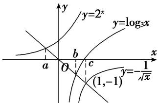

> [!faq]- 《专题17 函数的零点问题(4)-函数》例题解析
>
> > [!success]- **【答案】** A
>
> > [!note]- **【分析】**
> > 本题未单列分析。
>
> > [!note]- **【解析】**
> > 答案 A 解析 在同一坐标系下分别画出函数 $y = 2^{x}$ , $y = \log_3 x$ , $y = -\frac{1}{\sqrt{x}}$ 的图象, 如图, 观察它们与 $y = -x$ 的交点可知 $a < b < c$ .
> > 
