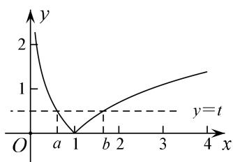

> [!faq]- 《专题17 函数的零点问题(4)-函数》例题解析
>
> > [!success]- **【答案】** D
>
> > [!note]- **【解析】**
> > 答案 D 解析 先做出 $f(x)$ 的图像，通过图像可知，如果 $f(a)=f(b)$ ，则 0<a<1<b，设 $f(a)=f(b)=t>0$ ，即 $|\ln a|=|\ln b|=t>0$ ，由 a, b 范围可得， $\ln a<0,\ \ln b>0$ ，从而 $a=e^{-t},\ b=e^{t}$ ，所以 $a+2b=e^{-t}+2e^{t}$ ，而 $e^{t}>0$ ，所以 $e^{-t}+2e^{t}\in(3,+\infty)$ .
> >
> > 
> >
> > 注：此类问题如果 $f(x)$ 图像易于作出，可先作图以便于观察函数特点.
> >
> > 本题有两个关键点，一个是引入辅助变量 t，从而用 t 表示出 a，b 达到消元效果，但是要注意 t 是有范围的（通过数形结合 y=t 需与 $y=f(x)$ 有两交点）；一个是通过图像判断出 a，b 的范围，从而去掉绝对值.
