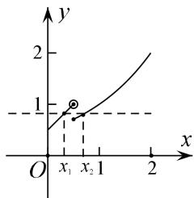

> [!faq]- 《专题17 函数的零点问题(4)-函数》例题解析
>
> > [!success]- **【答案】** C
>
> > [!note]- **【分析】**
> > 本题未单列分析。
>
> > [!note]- **【解析】**
> > 答案 C 解析 如图可知 $\frac{\sqrt{2} - 1}{2} \leq x_1 < \frac{1}{2}$ , $\frac{1}{2} \leq x_2 < 1$ , 所以 $x_1 f(x_2) - f(x_2) = (x_1 - 1)f(x_2) = (x_1 - 1)f(x_1) = (x_1 - 1)(x_1 + \frac{1}{2}) = x_1^2 - \frac{1}{2} x_1 - \frac{1}{2}$ . 所以 $x_1 f(x_2) - f(x_2) \in [-\frac{9}{16}, -\frac{1}{2})$ .
> >
> > 
