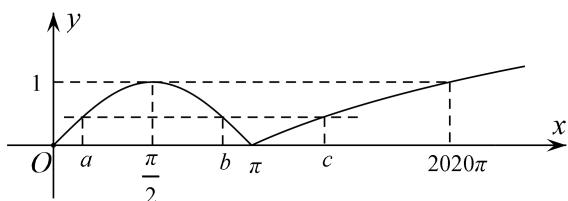

> [!faq]- 《专题17 函数的零点问题(4)-函数》例题解析
>
> > [!success]- **【答案】** 详见解析
>
> > [!note]- **【分析】**
> > 本题未单列分析。
>
> > [!note]- **【解析】**
> > 答案 (2π, 2021π) 解析 $f(x)$ 的图像可作，所以考虑作出 $f(x)$ 的图像，不妨设 $a < b < c$ ，由图像可得， $f(a) = f(b) \in (0, 1)$ ， $a, b \in [0, \pi]$ ，且关于 $x = \frac{\pi}{2}$ 轴对称，所以有 $\frac{a + b}{2} = \frac{\pi}{2}$ ，即 $a + b = \pi$ ，再观察 $c > \pi$ ，且 $f(c) = \log_{2020} \frac{c}{\pi} = f(a) \in (0, 1)$ ，所以 $0 < \log_{2020} \frac{c}{\pi} < 1$ ，即 $0 < c < 2020\pi$ ，从而 $a + b + c = \pi + c \in (2\pi, 2021\pi)$ .
> > 
> > 注：本题抓住 $a$ ， $b$ 关于 $x = \frac{\pi}{2}$ 对称是关键，从而可由对称求得 $a + b = \pi$ ，使得所求式子只需考虑 $c$ 的范围即可.
