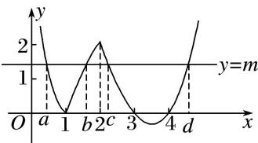

> [!faq]- 《专题17 函数的零点问题(4)-函数》例题解析
>
> > [!success]- **【答案】** 详见解析
>
> > [!note]- **【分析】**
> > 本题未单列分析。
>
> > [!note]- **【解析】**
> > 答案 (10, 12) 解析 作出函数 $f(x)$ 的图象，不妨设 $a < b < c < d$ ，则 $-\log_2 a = \log_2 b$ ， $\therefore ab = 1$ 。又根据二次函数的对称性，可知 $c + d = 7$ ， $\therefore cd = c(7 - c) = 7c - c^2 (2 < c < 3)$ ， $\therefore 10 < cd < 12$ ， $\therefore abcd$ 的取值范围是(10, 12).
> >
> > 
