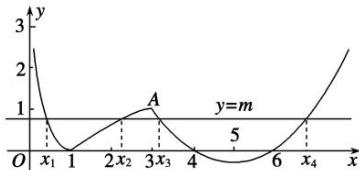

> [!faq]- 《专题17 函数的零点问题(4)-函数》例题解析
>
> > [!success]- **【答案】** B
>
> > [!note]- **【分析】**
> > 本题未单列分析。
>
> > [!note]- **【解析】**
> > 答案 B 解析 如图，作出函数 $f(x)$ 的图象，显然， $A(3,1)$ ，又当 $0<x\leq3$ 时， $f(x)\geq0$ ，因为方程 $f(x)=m$ 有四个不同的实根，所以 0<m<1。由 $f(x_{1})=f(x_{2})$ 可得， $|\log_{3}x_{1}|=|\log_{3}x_{2}|$ ，又因为 $0<x_{1}<1<x_{2}$ ，所以 $\log_{3}x_{1}+\log_{3}x_{2}=0$ ，解得 $x_{1}x_{2}=1$ 。因为函数 $y=\frac{1}{3}x^{2}-\frac{10}{3}x+8$ 的图象的对称轴为 x=5，
> > 
> > 故由 $f(x_{3})=f(x_{4})$ 可得 $x_{3}+x_{4}=10$ 。故 $\frac{(x_{3}-3)(x_{4}-3)}{x_{1}x_{2}}=(x_{3}-3)(x_{4}-3)=(x_{3}-3)(7-x_{3})=-x_{3}^{2}+10x_{3}-21=-(x_{3}-5)^{2}+4$ 。记 $g(t)=-(t-5)^{2}+4$ ，由 0<m<1 ，即 $0<\frac{1}{3}x^{2}-\frac{10}{3}x+8<1$ ，解得 3<x<4 或 6<x<7 。又 $x_{3}<x_{4}$ ，所以 $3<x_{3}<4$ ，又 $g(t)=-(t-5)^{2}+4$ 在 (3, 4) 上单调递增，所以当 3<t<4 时， $g
> > (3)<g(t)<g
> > (4)$ ，即 $g(t)\in(0,3)$ 。【对点训练】
