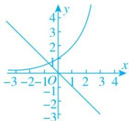
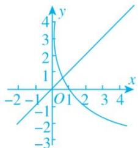
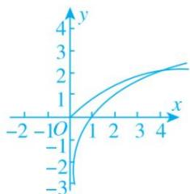
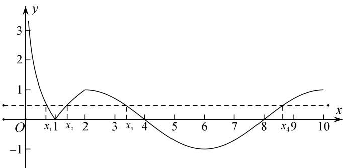

> [!faq]- 《专题17 函数的零点问题(4)-函数》例题解析
>
> > [!success]- **【答案】** A
>
> > [!note]- **【分析】**
> > 本题未单列分析。
>
> > [!note]- **【解析】**
> > 答案 D 解析 由 $f(x) = 2^x + x = 0$ ， $g(x) = x - \log_{\frac{1}{2}} x = 0$ ， $h(x) = \log_2 x - \sqrt{x} = 0$ 得 $2^x = -x$ ， $x = \log_{\frac{1}{2}} x$ ， $\log_2 x = \sqrt{x}$ 。在坐标系中分别作出 $y = 2^x$ ， $y = -x$ ； $y = x$ ， $y = \log_{\frac{1}{2}} x$ ； $y = \log_2 x$ ， $y = \sqrt{x}$ 的图象，由图象可知 $-1 < x_1 < 0$ ， $0 < x_2 < 1$ ， $x_3 > 1$ ，所以 $x_3 > x_2 > x_1$ 。
> >
> > 
> >
> > 
> >
> > 
> >
> > 15. 已知 $f(x) = |\ln (x + 1)|$ ，若 $f(a) = f(b)(a < b)$ ，则（ ）A. $a + b > 0$ B. $a + b > 1$ C. $2a + b > 0$ D. $2a + b > 1$
> >
> > 15. 答案 A 解析 作出函数 $f(x) = |\ln (x + 1)|$ 的图象如图所示，由 $f(a) = f(b)(a < b)$ ，得 $-\ln (a + 1) = \ln (b + 1)$ ，即 $ab + a + b = 0$ ，所以 $0 = ab + a + b < \frac{(a + b)^2}{4} + a + b$ ，即 $(a + b)(a + b + 4) > 0$ ，又易知 $-1 < a < 0$ ， $b > 0$ . 所以 $a + b + 4 > 0$ ，所以 $a + b > 0$ . 故选 A.
> >
> > 
> >
> > 16. 已知函数 $f(x)=\left\{\begin{aligned}\log_{a}(x+1)&-1<x<1\\ f(2-x)+a-1&1<x<3\end{aligned}\right.$ $(a>0,a\neq1)$ ，若 $x_{1}\neq x_{2}$ ，且 $f(x_{1})=f(x_{2})$ ，则 $x_{1}+x_{2}$ 的值（）
> > A. 恒小于 2    B. 恒大于 2    C. 恒等于 2    D. 与 a 相关
> >
> > 16. 分析 观察到当 $-1 < x < 1$ 时， $f(x)$ 为单调函数，且 $1 < x < 3$ 时， $f(x)$ 的图像相当于作 $-1 < x < 1$ 时关于 $x = 1$ 对称的图像再进行上下平移，所以也为单调函数。由此可得 $f(x_1) = f(x_2)$ 时， $x_1, x_2$ 必在两段上。设 $x_1 < x_2$ 可得 $-1 < x_1 < 1 < x_2 < 3$ ，考虑使用代换法设 $f(x_1) = f(x_2) = t$ ，从而将 $x_1, x_2$ 均用 $a, t$ 表示，再判断 $x_1 + x_2$ 与 2 的大小即可。
> >
> > 答案 B 解析 设 $f(x_{1}) = f(x_{2}) = t$ ，不妨设 $-1 < x_{1} < 1 < x_{2} < 3$ ，则 $-1 < 2 - x_{2} < 1$ ，所以 $\log_a(x_1 + 1) = t$ ， $x_{1} = a^t - 1$ ， $\log_a(3 - x_2) + a - 1 = t$ ， $x_{2} = 3 - a^{t+1-a}$ ，所以 $x_{1} + x_{2} = 2 + a^t - a^{t+1-a}$ ，若 $0 < a < 1$ ，则 $y = a^x$ 为减函数，且 $t < t + 1 - a$ ， $a^t > a^{t+1-a}$ ，所以 $x_{1} + x_{2} > 2$ 。若 $a > 1$ ，则 $y = a^x$ 为增函数，且 $t > t + 1 - a$ ， $a^t > a^{t+1-a}$ ，所以 $x_{1} + x_{2} > 2$ 。所以 $x_{1} + x_{2}$ 的值恒大于 2。
> >
> > 17. 已知函数 $f(x) = \begin{cases} |\log_2 x - 1|, & 0 < x \leq 4, \\ 3 - \sqrt{x}, & x > 4, \end{cases}$ 设 $a, b, c$ 是三个不相等的实数，且满足 $f(a) = f(b) = f(c)$ ，则 abc
> >
> > 的取值范围为\_\_\_\_。
> >
> > 17. 答案 (16, 36) 解析 作出 $f(x)$ 的图象如图，
> >
> > 
> >
> > 当 x>4 时，由 $f(x)=3-\sqrt{x}=0$ ，得 $\sqrt{x}=3$ ，得 x=9，若 a, b, c 互不相等，不妨设 a<b<c，因为 $f(a)=f(b)=f(c)$ ，所以由图象可知 0<a<2<b<4<c<9，由 $f(a)=f(b)$ ，得 $1-\log_{2}a=\log_{2}b-1$ ，即 $\log_{2}a+\log_{2}b=2$ ，即 $\log_{2}(ab)=2$ ，则 ab=4，所以 abc=4c，因为 4<c<9，所以 16<4c<36，即 16<abc<36，所以 abc 的取值范围是 (16, 36).
> >
> > 18. 已知函数 $f(x) = \begin{cases} |\log_2 x|, & 0 < x < 2, \\ \sin(\frac{\pi}{4} x), & 2 \leqslant x \leqslant 10, \end{cases}$ 若存在实数 $x_1, x_2, x_3, x_4$ ，满足 $x_1 < x_2 < x_3 < x_4$ ，且 $f(x_1) = f(x_2) =$
> >
> > $f(x_{3}) = f(x_{4})$ ，则 $\frac{(x_3 - 2)(x_4 - 2)}{x_1x_2}$ 的取值范围是（ ）A. (4, 16) B. (0, 12) C. (9, 21) D. (15, 25)
> >
> > 18. 答案 B 解析 不妨设 $f(x_{1})=f(x_{2})=f(x_{3})=f(x_{4})=a$ ，作出 $f(x)$ 的图像，y=a 与 $y=f(x)$ 有四个不同交点，则 $a \in (0, 1)$ ，且 $x_1 < 1 < x_2$ 。 $x_3$ ， $x_4$ 关于 $x = 6$ 对称。所以有 $-\log_2 x_1 = \log_2 x_2$ ，即 $x_1 x_2 = 1$ 且 $x_3 + x_4 = 12$ 即 $\frac{(x_3 - 2)(x_4 - 2)}{x_1 x_2} = x_3 x_4 - 20$ ，因为 $x_3 + x_4 = 12$ ，所以 $x_3 = 12 - x_4$ ，所以 $\frac{(x_3 - 2)(x_4 - 2)}{x_1 x_2} = x_4 (12 - x_4) - 20$ ， $x_4 \in (8, 10)$ ，所以 $\frac{(x_3 - 2)(x_4 - 2)}{x_1 x_2}$ 的范围为 $(0, 12)$ 。
> >
> > 
> >
> > 19. 设 $x_1, x_2$ 分别是函数 $f(x) = x - a^{-x}$ 和 $g(x) = x\log_a x - 1$ 的零点(其中 $a > 1$ ), 则 $x_1 + 4x_2$ 的取值范围是 $\_$ .  
> > 19. 答案 (5, +∞) 解析 $f(x) = x - a^{-x}$ 的零点 $x_1$ 是方程 $x = a^{-x}$ , 即 $\frac{1}{x} = a^x$ 的解, $g(x) = x\log_a x - 1$ 的零点 $x_2$ 是方程 $x\log_a x - 1 = 0$ , 即 $\frac{1}{x} = \log_a x$ 的解, 即 $x_1, x_2$ 是 $y = a^x$ 与 $y = \log_a x$ 与 $y = \frac{1}{x}$ 交点 $A, B$ 的横坐标, 可得 $0 < x_1 < 1, x_2 > 1$ , $\because y = a^x$ 的图象与 $y = \log_a x$ 关于 $y = x$ 对称, $y = \frac{1}{x}$ 的图象也关于 $y = x$ 对称, $\therefore A, B$ 关于 $y = x$ 对称, 设 $A\left(x_1, \frac{1}{x_1}\right), B\left(x_2, \frac{1}{x_2}\right)$ , $\therefore A$ 关于 $y = x$ 的对称点 $A'\left(\frac{1}{x_1}, x_1\right)$ 与 $B$ 重合, $\frac{1}{x_2} = x_1$ , 即 $x_2x_1 = 1$ , $x_1 + 4x_2 = x_1 + x_2 + 3x_2 > 2\sqrt{x_1x_2} + 3x_2 > 2 + 3 = 5$ , $x_1 + 4x_2$ 的取值范围是(5, +∞).
> >
> > 20. 已知 $f(x) = \begin{cases} |x + 1|, & x \leq 0, \\ |\log_2 x|, & x > 0, \end{cases}$ 若方程 $f(x) = a$ 有四个不同的解 $x_1 < x_2 < x_3 < x_4$ ，则 $x_1 + x_2 + \frac{1}{x_3} + \frac{1}{x_4}$ 的取值范围是( )
> >
> > A. $[0, \frac{1}{2})$ B. $(0, \frac{1}{2}]$ C. $[0, \frac{1}{2}]$ D. $[0, 1)$
> >
> > 20. 答案 B 解析 作出 $f(x)$ 的图像可知若 $f(x) = a$ 有四个不同的解，则 $a \in (0,1]$ ，且在这四个根中， $x_1, x_2$ ，关于直线 $x = -1$ 对称，所以 $x_1 + x_2 = -2$ ， $x_3 < 1 < x_4$ ，所以 $a = -\log_2 x_3 = \log_2 x_4$ ，即 $x_3 = (\frac{1}{2})^a$ ， $x_4 = 2^a$ ，所以 $g(a) = x_1 + x_2 + \frac{1}{x_3} + \frac{1}{x_4} = -2 + 2^a + (\frac{1}{2})^a$ ，由 $a \in (0,1]$ ，可得 $g(a)$ 的范围是 $(0, \frac{1}{2}]$ .
> >
> > 
