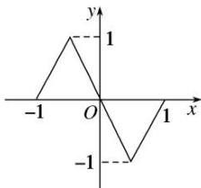
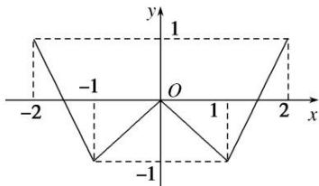

<!-- question-source:start -->
[例 1] (1) 奇函数 $f(x)$ ，偶函数 $g(x)$ 的图象分别如图(1)，(2) 所示，函数 $f(g(x))$ ， $g(f(x))$ 的零点个数分别为 m，n，则 $m + n = (\quad)$

图(1)

图(2)

A. 3 B. 7 C. 10 D. 14

(2)关于 $x$ 的方程 $(x^{2} - 1)^{2} - 3|x^{2} - 1| + 2 = 0$ 的不相同实根的个数是（ ）A.3 B.4 C.5 D.8

(3)已知 $f(x)=\left\{\begin{aligned}&\lg x|,\quad x>0,\\ &2^{|x|},\quad x\leq0,\end{aligned}\right.$ 则函数 $y=2[f(x)]^{2}-3f(x)+1$ 的零点个数是\_\_\_\_.

(4)已知定义在 $\mathbf{R}$ 上的奇函数，当 $x > 0$ 时， $f(x) = \begin{cases} 2^{|x - 1|} - 1, & 0 < x \leq 2, \\ \frac{1}{2} f(x - 2), & x > 2, \end{cases}$ 则关于 $x$ 的方程 $6f^2 (x) - f(x) - 1 = 0$ 的实数根个数为（）A.6 B.7 C.8 D.9
<!-- question-source:end -->

![[高中/总复习/专题/函数/专题18 函数的零点问题(5)-函数/专题十八_函数的零点问题_5_/考点一_确定复合函数零点的个数或方程解的个数/例题选讲/例题/answers/Q00030294A1.md]]
