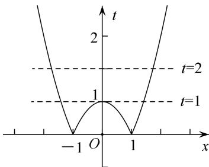
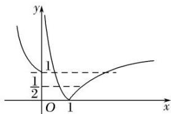
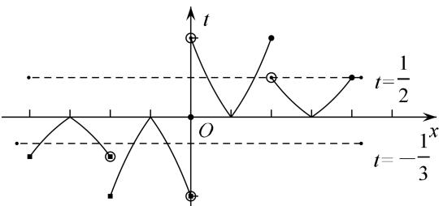

> [!faq]- 教师版例题解析
>
> > [!success]- **【答案】** (1) C；(2) C；(3) 5；(4) B
>
> > [!note]- **【分析】**
> > 本题未单列分析。
>
> > [!note]- **【解析】**
> > 答案 C 解析 由题中函数图象知 $f(\pm 1) = 0$ , $f(0) = 0$ , $g\left[\frac{\pm 3}{2}\right] = 0$ , $g(0) = 0$ , $g(\pm 2) = 1$ , $g(\pm 1) = -1$ , 所以 $f(g(\pm 2)) = f(1) = 0$ , $f(g(\pm 1)) = f(-1) = 0$ , $f\left[g\left[\frac{\pm 3}{2}\right]\right] = f(0) = 0$ , $f(g(0)) = f(0) = 0$ , 所以 $f(g(x))$ 有 7 个零点, 即 $m = 7$ . 又 $g(f(0)) = g(0) = 0$ , $g(f(\pm 1)) = g(0) = 0$ , 所以 $g(f(x))$ 有 3 个零点, 即 $n = 3$ . 所以 $m + n = 10$ , 选择 C.
> > 答案 C 解析 可将 $|x^{2}-1|$ 视为一个整体，即 $t=|x^{2}-1|$ ，则方程变为 $t^{2}-3t+2=0$ 可解得，t=1 或 t=2，则只需作出 $t(x)=|x^{2}-1|$ 的图像，然后统计与 t=1 与 t=2 的交点总数即可，共有 5 个.
> > 
> > 答案 5 解析 由 $2[f(x)]^{2}-3f(x)+1=0$ 得 $f(x)=\frac{1}{2}$ 或 $f(x)=1$ ，作出函数 $y=f(x)$ 的图象。由图象知 $y=\frac{1}{2}$ 与 $y=f(x)$ 的图象有 2 个交点，y=1 与 $y=f(x)$ 的图象有 3 个交点。因此函数 $y=2[f(x)]^{2}-3f(x)+1$ 的零点有 5 个。
> > 
> > 答案 B 解析 已知方程 $6f^{2}(x) - f(x) - 1 = 0$ 可解，得 $f_{1}(x) = \frac{1}{2}, f_{2}(x) = -\frac{1}{3}$ ，只需统计 $y = \frac{1}{2}, y = -\frac{1}{3}$ 与 $y = f(x)$ 的交点个数即可。由奇函数可先做出 $x > 0$ 的图像， $x > 2$ 时， $f(x) = \frac{1}{2} f(x - 2)$ ，则 $x \in (2, 4]$ 的图像只需将 $x \in (0, 2]$ 的图像纵坐标缩为一半即可。正半轴图像完成后可再利用奇函数的性质作出负半轴图像。通过数形结合可得共有7个交点。
> > 
> > 在作图的过程中，注意确定分段函数的边界点属于哪一段区间.
