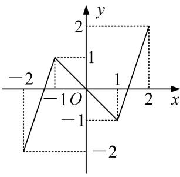
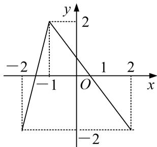

<!-- question-source:start -->
1. 已知函数 $y = f(x)$ 和 $y = g(x)$ 在 $[-2, 2]$ 的图像如下，给出下列四个命题：

(1)方程 $f[g(x)]=0$ 有且只有 6 个根；(2)方程 $g[f(x)]=0$ 有且只有 3 个根；

(3)方程 $f[f(x)] = 0$ 有且只有5个根；(4)方程 $g[g(x)] = 0$ 有且只有4个根.

$y=f(x)$

$y = g(x)$

则正确命题的个数是( )
A. 1    B. 2    C. 3    D. 4
<!-- question-source:end -->

![[高中/总复习/专题/函数/专题18 函数的零点问题(5)-函数/专题十八_函数的零点问题_5_/考点一_确定复合函数零点的个数或方程解的个数/对点训练/题目/answers/Q00030295A1.md]]
