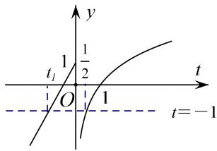
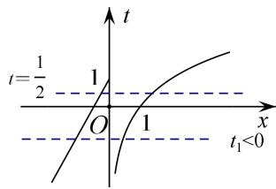
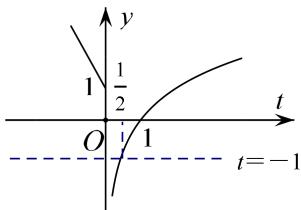
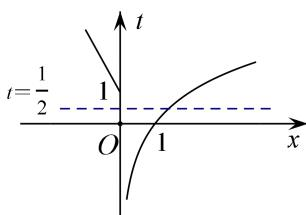

> [!faq]- 教师版对点训练解析
>
> > [!success]- **【答案】** A
>
> > [!note]- **【分析】**
> > 本题未单列分析。
>
> > [!note]- **【解析】**
> > 答案 A 解析 所求函数的零点，即方程 $f(f(x)) = -1$ 的解的个数，令 $t = f(x)$ ，先作出 $y = f(t)$ 的图像，直线 $y = ax + 1$ 为过定点 $(0, 1)$ 的一条直线，但需要对 a 的符号进行分类讨论。当 a > 0 时，如图 1 所示，先拆外层可得 $t_{1} = \frac{2}{a} < 0$ ， $t_{2} = \frac{1}{2}$ ，如图 2 所示，而 $t_{1}$ 有两个对应的 x， $t_{2}$ 也有两个对应的 x，共计 4 个；当 a < 0 时，如图 3 所示，先拆外层可得 $t = \frac{1}{2}$ ，如图 4 所示， $t = \frac{1}{2}$ 只有一个满足的 x，所以共 1 个零点。结合选项，可判断出 A 正确。
> > 
> > 图1(a>0)
> > 
> > 图2(a>0)
> > 
> > 图3(a<0)
> > 
> > 图4(a<0)
