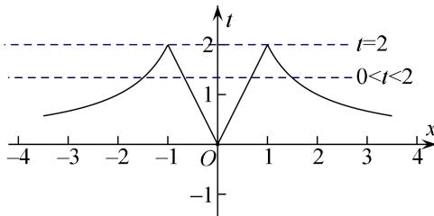

> [!faq]- 教师版对点训练解析
>
> > [!success]- **【答案】** 详见解析
>
> > [!note]- **【分析】**
> > 本题未单列分析。
>
> > [!note]- **【解析】**
> > 答案 $-4 < a < -2$ 解析 所解方程 $f^2(x) + a|f(x)| + b = 0$ 可视为 $|f(x)|^2 + a|f(x)| + b = 0$ ，故考虑作出 $|f(x)|$ 的图像， $f(x) = \begin{cases} \frac{2}{x}, & x > 1 \\ 2x, & 0 < x \leq 1 \\ -2x, & -1 \leq x < 0 \\ -\frac{2}{x}, & x < -1, \end{cases}$ ，则 $t = |f(x)|$ 的图像如图，由图像可知，若有6个不同实数解，则
> > 必有 $t_{1}=2,\quad0<t_{2}<2$ ，所以 $-a=t_{1}+t_{2}\in(2,4)$ ，解得 -4<a<-2.
> > 
